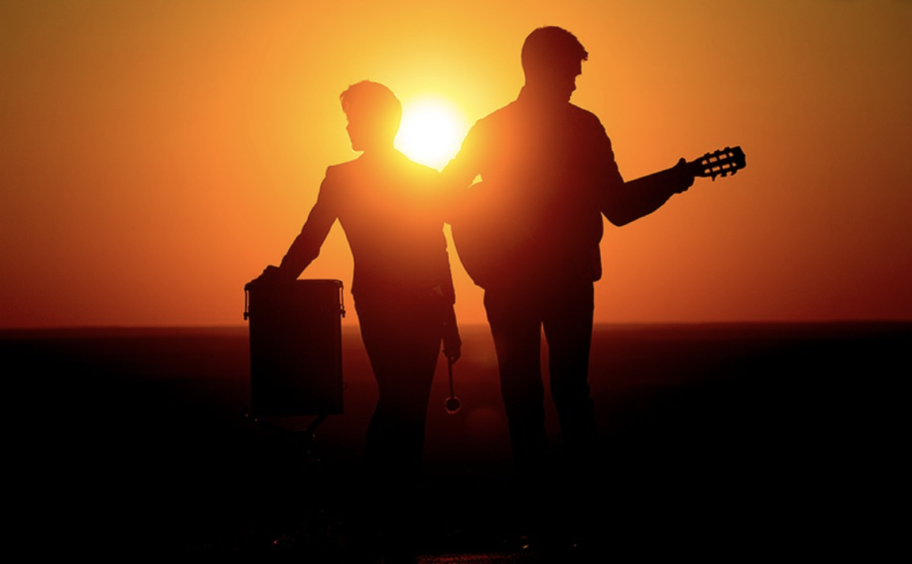

```{r setup, include=FALSE}
knitr::opts_chunk$set(echo = TRUE)
```

```{r echo=FALSE, warning=FALSE, message=FALSE}
library(data.table)
library(knitr)
library(ggplot2)
library(dplyr)
library(wordcloud2)
library(tidyverse)
library(tidytext)
library(tm)
library(RColorBrewer)
library(DT)
library(gplots)
library(ggridges)
library(gridExtra)
```

>#**Songs by genre**
<center>By Jongyoon Sohn, js5342@columbia.edu</center>  

___

 

\newline
\newline
\newline


People have been living in a world full of various sentiments such as excitements, sadness, happiness, etc. Songs have been used as representatives of emotions towards love, politics and even more. In this project, it will deliver some interesting findings about songs.


```{r load data, warning=FALSE, message=FALSE, echo=FALSE}
# load lyrics data
load('../output/processed_lyrics.RData')
# load artist information
dt_artist <- fread('../data/artists.csv')
```

___

# Word counts

```{r echo=FALSE, message=FALSE, warning=FALSE, fig.align='center'}
dt_lyrics$nwords <- nchar(dt_lyrics$stemmedwords)
dt_lyrics %>%
  group_by(genre) %>%
  summarise(n=sum(nwords)) %>%
  filter(genre!="Not Available") %>%
  ggplot() +
  geom_bar(aes(x=reorder(genre,-n),y=n), stat = "identity") +
  ggtitle("Number of words used") +
  xlab("Genre") +
  ylab("Word Counts") +
  coord_flip() +
  theme_classic() +
  theme(
    plot.title = element_text(color="red", size=14, face="bold.italic"),
    axis.title.x = element_text(size=14, face="bold"),
    axis.title.y = element_text(size=14, face="bold"),
    axis.text = element_text(size = 15))
```


First, let’s take a look at the number of characters of stemmed words by genre. As you can see, the number of characters used in *Rock* is the biggest, even 2 times more than that of *Hip-Hop*, the next frequent genre. I looked at the *dt_lyrics* dataset more closely and found out that there are significant imbalances in observations, i.e. high number of observations in 2006 and 2007 compared to the rest years, so that it concludes that it makes sense to compare them in proportions rather than the counts. For the purpose of simplicity, two genres, [**Rock**](https://en.wikipedia.org/wiki/Rock_music) and [**Indie**](https://en.wikipedia.org/wiki/Independent_music), are chosen to see if there are some differences.

---

# Which words are used the most?

```{r echo=FALSE, message=FALSE, warning=FALSE, fig.align='center', out.width="70%"}
corpus <- VCorpus(VectorSource(dt_lyrics$stemmedwords))
word_tibble <- tidy(corpus) %>%
  select(text) %>%
  mutate(id = row_number()) %>%
  left_join(dt_lyrics, by='id') %>%
  select(id, text, year, genre) %>%
  unnest_tokens(word, text)

set.seed(1)
R<-word_tibble %>%
  filter(genre=="Rock") %>%
  group_by(word) %>%
  count() %>%
  arrange(desc(n)) %>%
  letterCloud(word='R', color='random-light', backgroundColor='dark')

```


```{r echo=FALSE, message=FALSE, warning=FALSE, fig.align='center', out.width="70%"}
set.seed(1)
I<-word_tibble %>%
  filter(genre=="Indie") %>%
  group_by(word) %>%
  count() %>%
  arrange(desc(n)) %>%
  letterCloud(word='I', color='random-light', backgroundColor='dark')

```

These are wordclouds that show which words are frequently used, presented in different sizes. Two plots show that two genres have top frequently used words in common. For example, they all talk about *youre*, *time*, *life* a lot. Major differences in frequencies are hard to distinguish and common words are frequently used regardless of genres.

---

# Emotions come from songs

 


We sing because we want to express our feelings through songs so the sentiment analysis is the most important part in this project. Let's look at some of characteristics of stemmed words by the sentiment analysis referenced by [the NRC lexicon](http://saifmohammad.com/WebPages/NRC-Emotion-Lexicon.htm). In each year, the frequencies of eight basic emotions were collected in percent and calculated to show the emotion distributions.


### Emotions distribution

```{r echo=FALSE, message=FALSE, warning=FALSE, fig.align='center', fig.width = 10, fig.height = 5}
a <- word_tibble %>%
  left_join(get_sentiments("nrc"), by = "word") %>%
  filter(!(sentiment == "negative" | sentiment == "positive" | sentiment == "NA")) %>%
  group_by(year, sentiment) %>%
  summarize(freq = n()) %>%
  mutate(percent=round(freq/sum(freq)*100)) %>%
  select(-freq) %>%
  filter(year>=1968)

gh <- a %>%
  ggplot(aes(reorder(sentiment,-percent,mean),percent)) +
  geom_boxplot() +
  xlab("Emotion") +
  ylab("Emotion word counts (%) each year") +
  ggtitle("Emotion word counts in 1968-2016") +
  theme_classic() +
  theme(
    plot.title = element_text(color="red", size=14, face="bold.italic"),
    axis.title.x = element_text(size=14, face="bold"),
    axis.title.y = element_text(size=14, face="bold"),
    axis.text = element_text(size = 15)) +
  coord_flip()

gr <- a %>%
  ggplot(aes(percent,reorder(sentiment, -percent, mean))) +
  geom_density_ridges2(fill='blue',alpha=.5) +
  #ylab("Emotion") +
  xlab("Emotion word counts (%) each year") +
  ggtitle("Emotion word counts in 1968-2016") +
  theme_classic() +
  theme(
    plot.title = element_text(color="red", size=14, face="bold.italic"),
    axis.title.x = element_text(size=14, face="bold"),
    axis.title.y = element_blank(),
    axis.text = element_text(size = 15))

grid.arrange(gh, gr, nrow = 1)
```

All eight emotions are expressed at word counts rates. At the first plot, joy, sadness, trust have the highest frequencies in use than others. In addition, the right plot shows the density distribution of emotions, which tells us that emotions such as surprise, disgust, fear are approximately normally distributed but those such as joy, sadness, anger are highly skewed.

### What about Hip-Hop, Indie, Rock?

```{r echo=FALSE, message=FALSE, warning=FALSE, fig.align='center', fig.width = 10, fig.height = 8}
word_tibble %>%
  filter(year>=1968) %>%
  filter(genre=='Rock'|genre=='Hip-Hop'|genre=='Indie') %>%
  left_join(get_sentiments("nrc"), by = "word") %>%
  filter(!(sentiment == "negative" | sentiment == "positive" | sentiment == "NA")) %>%
  group_by(year, genre, sentiment) %>%
  summarize(freq = n()) %>%
  mutate(percent=round(freq/sum(freq)*100)) %>%
  select(-freq) %>%
  ggplot(aes(percent,fct_reorder(sentiment, -percent, median))) +
  geom_density_ridges2(fill = 'blue', alpha = .5, bandwidth = .5) +
  facet_wrap(~genre, ncol = 1, scales = "free") +
  ylab("Emotion") +
  xlab("Emotion word counts (%) each year") +
  ggtitle("Emotion word counts in 1968-2016") +
  theme_classic() +
  theme(
    plot.title = element_text(color="red", size=14, face="bold.italic"),
    axis.title.x = element_text(size=14, face="bold"),
    axis.title.y = element_blank(),
    axis.text = element_text(size = 15))
```

This graph shows how different the emotions would be distributed depending on different genres. So ridgeline plots are made to represent the distribution of emotions used in *Hip-Hop*, *Indie*, and *Rock*. Obviously, the emotions used in each of three genres are distributed very differently.

---

# Does time affect the sentiments?

```{r echo=FALSE, message=FALSE, warning=FALSE, fig.align='center'}
word_tibble %>%
  left_join(get_sentiments("nrc"), by = "word") %>%
  filter(!(sentiment == "negative" | sentiment == "positive" | sentiment == "NA" | year <= 1960)) %>%
  group_by(year, sentiment) %>%
  summarize(freq = n()) %>%
  mutate(percent=round(freq/sum(freq)*100)) %>%
  ggplot(aes(x=year, y=percent, color=sentiment, group=sentiment)) +
  geom_line(size=1) +
  geom_point(size=.5) +
  xlab("Year") +
  ylab("Emotion word counts (%)") +
  ggtitle("Emotion words in percent by year") +
  theme_classic() +
  theme(
    plot.title = element_text(color="red", size=14, face="bold.italic"),
    axis.title.x = element_text(size=14, face="bold"),
    axis.title.y = element_text(size=14, face="bold"),
    axis.text = element_text(size = 15))
```

So I got curious if the sentiments of songs are distributed equally through the time spans. This plot represents the time series of each emotion by year. Overall, joy and sadness are most used sentiments in songs regardless of genres, but the frequencies are starting to change constantly as time goes by.

```{r echo=FALSE, message=FALSE, warning=FALSE, fig.align='center'}
word_tibble %>%
  left_join(get_sentiments("nrc"), by = "word") %>%
  filter(!(sentiment == "negative" | sentiment == "positive" | sentiment == "NA" | year <= 1960)) %>%
  filter(genre=="Rock") %>%
  group_by(year, sentiment) %>%
  summarize(freq = n()) %>%
  mutate(percent=round(freq/sum(freq)*100)) %>%
  ggplot(aes(x=year, y=percent, color=sentiment, group=sentiment)) +
  geom_line(size=1) +
  geom_point(size=.5) +
  xlab("Year") +
  ylab("Emotion word counts (%)") +
  ggtitle("Rock Music") +
  theme_classic() +
  theme(
    plot.title = element_text(color="red", size=14, face="bold.italic"),
    axis.title.x = element_text(size=14, face="bold"),
    axis.title.y = element_text(size=14, face="bold"),
    axis.text = element_text(size = 15))

word_tibble %>%
  left_join(get_sentiments("nrc"), by = "word") %>%
  filter(!(sentiment == "negative" | sentiment == "positive" | sentiment == "NA" | year <= 1960)) %>%
  filter(genre=="Indie") %>%
  group_by(year, sentiment) %>%
  summarize(freq = n()) %>%
  mutate(percent=round(freq/sum(freq)*100)) %>%
  ggplot(aes(x=year, y=percent, color=sentiment, group=sentiment)) +
  geom_line(size=1) +
  geom_point(size=.5) +
  xlab("Year") +
  ylab("Emotion word counts (%)") +
  ggtitle("Indie Music") +
  theme_classic() +
  theme(
    plot.title = element_text(color="red", size=14, face="bold.italic"),
    axis.title.x = element_text(size=14, face="bold"),
    axis.title.y = element_text(size=14, face="bold"),
    axis.text = element_text(size = 15))
```

Interestingly, not all genres have the similar emotions distribution. Major differences in sentiments are found in *Rock* and *Indie*. Those two plots above show that the sentiment plot in *Rock* seems to follow the distribution of the overall. However, the sentiment plot in *Indie* is telling a completely different series. Therefore, emotions used in different genres are distributed significantly different by time.

---

# Conclusions

 


\newline
\newline
\newline

+ Major differences in frequencies are hard to distinguish and common words are frequently used regardless of genres.

+ Different genres, i.e. *Rock* and *Indie*, have top frequently used words in common.

+ Emotions used in different genres are distributed significantly different by time.


## Disclaimer

The purpose of this project is to demonstrate the exploratory data analysis, not statistical test results. When *significantly different* is mentioned, keep in mind that it does not result from a statistical test.

